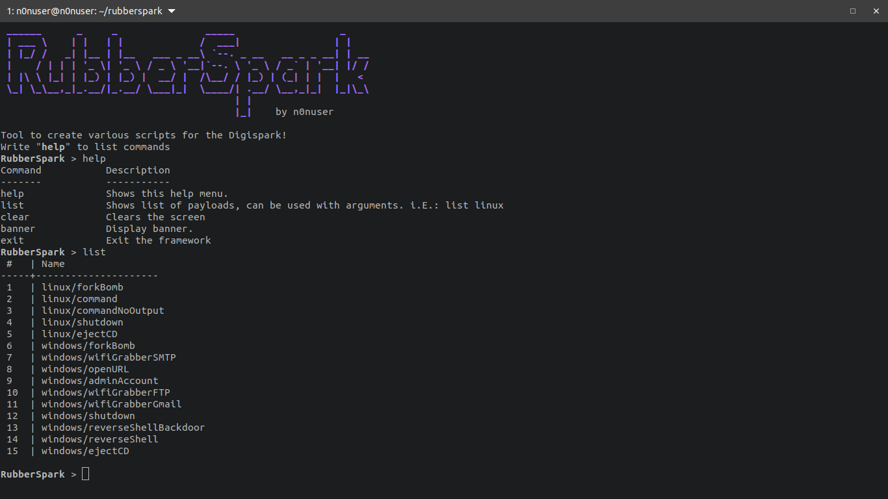
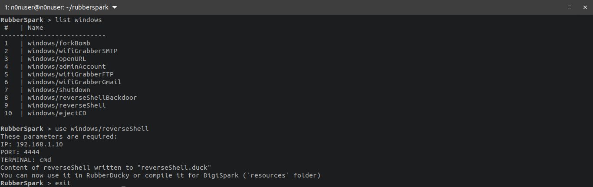

# RubberSpark

RubberSpark is a modular and light-weight framework that aims to provide all the Ducky scripts that you may need in a Red Teaming engagement.

## Screenshots





## Features

- List all modules, or specific OS modules
- Use modules with parameters and write result to `.duck` file

### Roadmap

- Autocomplete
- History of commands
- Ability to use resource files to send commands directly to the framework
- Ability to save command history (makerc)

## Usage

```bash
git clone https://github.com/n0nuser/rubberspark
cd rubberspark
python3 rubberspark.py
```

After saving the `.duck` script, you can either directly use it in a RubberDucky; or in case of using it in a DigiSpark, you can use the `ccRun.sh` that uses both MaMe82's Duck2Spark and DuckEncoder. This automates the task of compiling the script all the way directly to an Arduino sketch.

> Be sure to change the locale and the Arduino path if needed!

### Commands

```txt
Command           Description
-------           -----------
help              Shows this help menu.
list              Shows list of payloads, can be used with arguments. i.E.: list linux
clear             Clears the screen
banner            Display banner.
exit              Exit the framework
```

### Adding modules

It's as easy as adding a module in each OS folder in `core/modules/`.

You can request an issue to upload a python file with the same structure to keep it in the repo in the future!

Structure of python file:

```py
class info:
    author="AUTHOR"
    description = "DESCRIPTION OF MODULE"
    function = "ITS USE"
    parameters = [ "IP", "PORT" ]
    content = """\
DUCKY
COMMANDS
HERE\
"""
```

## Contact

The framework has a lot of room for improvements as its my first framework.

I'll be glad to receive any feedback to make Rubberspark better!

I have all my contact links in [my webpage](https://www.nonuser.es/#contact).

## Disclaimer

Do not attempt to violate the law with the framework. If you plan to use it for illegal purposes, then please be sure you have explicit permission, else deny doing it.

I will not hold responsibility for any of your actions.

## Credits and References

- [D4vinci - Oneli3r](https://github.com/D4Vinci/One-Lin3r): I took his framework as a reference to create this.
- [MaMe82 - Duck2Spark](https://github.com/mame82/duck2spark): Tool to convert `.duck` into `.bin`.
- [MaMe82 - DuckEncoder](https://github.com/mame82/duckencoder.py): Tool to convert `.bin` into `.ino`.
